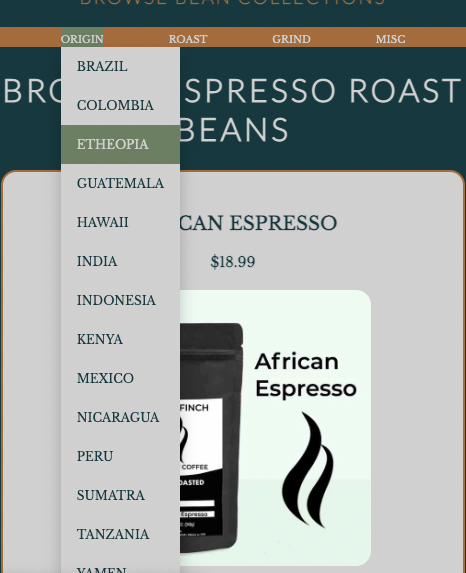
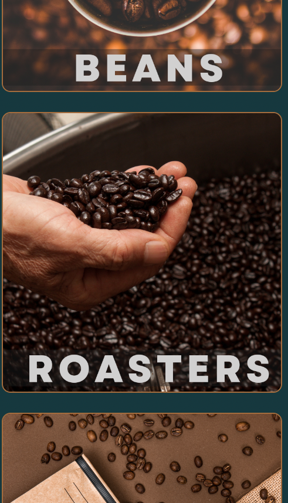
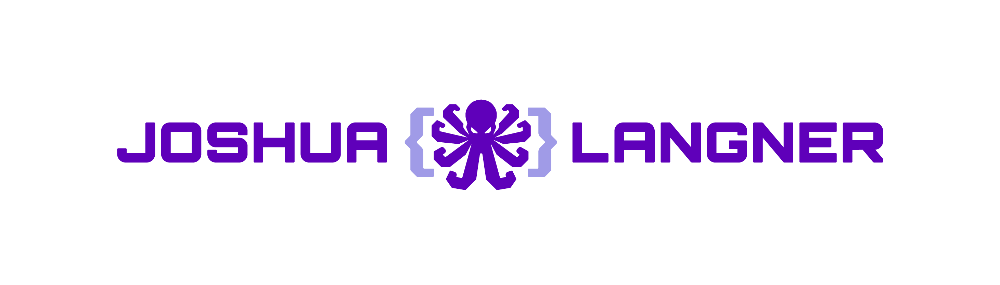

### Joshua M. Langner
#### Date: 9/14/2022

---

| [LinkedIn](https://www.linkedin.com/in/josh-langner-48) | [GitHub](https://github.com/jlangner87) | [Portfolio](https://joshua-langner.com) |

---

#### Deployed Application:
*This application is currently not deployed due to loss of free hosting service. As of 03/19/2023, I am searching for a home for this app. This doccumentation shows how to load this application on a localhost*

---

### **_Description_**

#### I am a coffee connoisseur. I love it. I need it.

#### I particularly enjoy filling my bean hopper with unique small batch roasts from independently owned roasteries. The problem is that they are difficult to find. They are typically buried under the large corporate operations with massive advertisement budgets.

#### **_Enter WikiBean!_**

This is an app for 4 types of users.
- The Roaster
- The Retailer
- The Brewer (upcoming release)
- The Connoisseur (upcoming release)

The Roaster (the roasterie owner) can set up a profile for their roasterie. On that profile, they can keep an up to date (fully mutable) list of the beans they are roasting with details.

The Retailer (the store owner/manager) can browse roasteries, make supplier/retailer relations with the Roasters, and even list the collections of beans that they sell at their location.

The Brewer has the same functionality as the retailer with one  key difference. This model tells 

The Connoisseur (the average Joe who just loves a good cup of Joe) can also browse the beans by collection. The application uses the "Bean" model attributes to sort the beans into easily browsable collections based off of the attributes

---

### **Getting Started**
- Fork and Clone this repository
- npm install
- npm run dev (to start the express server)
- npm run start (to launch the React app in a browser)

---

### **_Technologies Used_**

- JavaScript
- CSS
- HTML
- React.JS
- PostgresSQL
- Express

---

### **_Project Requirements_**

### **_Entity Relationship Diagram_**

### **_Component Hierarchy Diagram_**

### **_Screenshots_**

#### Desktop/Mobile Mockup

#### Dropdown Menu for quick queries

#### Mobile friendly styling

---
### **Future Development Opportunity**

##### Add conditional authentication with separate authorization for each of three user models.

##### Connoisseur model: Can leave reviews, "favorite" beans for later, and rank beans on a scale of 1-5 beans.

##### Additional Bean attributes
- Fair-Trade
- Good Causes
- Non-Profit
- Decaf
- Veteran Owned

---

### _Credits & Citations_

##### useParams Docs [Remix_ReactRouter](https://v5.reactrouter.com/web/api/Hooks/useparams)

##### CSS Dropdown Menu [W3Schools](https://www.w3schools.com/css/css_dropdowns.asp)

##### Querying with Logical Operators [Sequelize_docs](https://sequelize.org/docs/v6/core-concepts/model-querying-basics/)

##### Multiple URL Params Syntax [StackOverflow](https://stackoverflow.com/questions/15128849/using-multiple-parameters-in-url-in-express)

---

